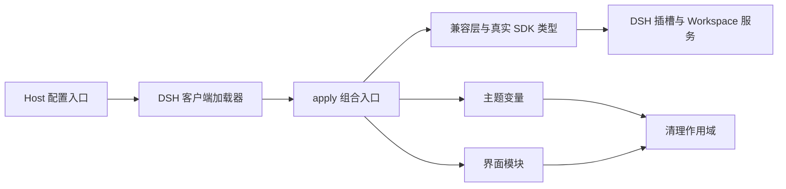

# 项目架构

更新日期：2026-10-01。本文件描述当前骨架事实；产品目标见 PLAN，后续任务见实施交接。

插件消费 DSH 的配置、服务与界面插槽，输出可撤销的样式和展示组件。Workspace、Session、消息、输入编辑器与执行状态由 DSH 持有；本项目只拥有启用状态、设计变量、展示组件及其资源。当前所有界面 feature 都是 `planned`，已实现的是加载、配置解析、资源释放、主题变量和开发检查。

## 代码地图与边界

| 目录 | 职责 | 允许的依赖 |
| --- | --- | --- |
| `src/shared` | 插件身份、配置与 feature 标识 | 自身；不依赖宿主或 DOM |
| `src/host` | Host 插件入口、Schemastery 配置 | shared、Host 运行依赖 |
| `src/client/contracts` | FeatureEnvironment、FeatureDefinition、服务与 DOM 端口 | shared、SDK 类型；CleanupScope 仅类型引用 |
| `src/client/core` | 通用清理和 feature 装配流程 | contracts、shared、core |
| `src/client/compat` | 固定版本的服务接入、DOM 所有权、插槽名称 | contracts、shared、compat |
| `src/client/theme` | 设计变量和语义 token 覆盖 | contracts、shared、core、theme |
| `src/client/features/*` | shell、sidebar、new-session、conversation、tool-calls、statistics | 本模块、公共契约／核心／兼容／主题；不能导入兄弟模块 |
| `src/client/apply.ts` | 唯一的多模块运行组合点 | 上述客户端模块 |
| `scripts` | 构建、架构检查和安装包检查 | 开发依赖、Node IO |
| `tests` | 资源恢复与失败隔离的行为验证 | 内部模块，不扩大公共导出 |

**API 边界：** `HostServices` 使用 SDK 原始类型／派生类型，`DomPort` 是本项目管理样式与启用标记的端口。DSH 插槽组件 props 仍由 SDK 推导，不能用自定义 props 复制它的标准 hook 或授权渲染接口。Context 只进入 apply／兼容与注册世界，组件通过派生 props、注入数据和回调访问能力。

## 启用、更新与释放

1. Host `Config` 声明配置；客户端 `resolveConfig()` 独立补全并校验配置，避免将 Schemastery 打进浏览器包。
2. `enabled` 默认为 false。启用时 Cordis 已等待 `slots`、`theme`、`uiWorkspace` 服务，再建立一个 `ctx.effect`。
3. 主题挂载根属性与设计变量。现有语义 token 覆盖表为空，因此骨架没有视觉替换。
4. `mountFeatures()` 只执行已实现且配置启用的模块，为每个模块创建独立 CleanupScope。`planned` 只在 debug 下记录状态。
5. 单个模块挂载失败时回滚已取得的资源，记录错误并继续其他模块；总启用失败时释放全部资源。
6. 停用／配置重新加载／Cordis effect 释放后，以逆序释放资源，每个 disposer 只执行一次。共享启用标记按同一模块实例内的租约计数管理，旧激活不会提前清除新激活的标记。

当前配置是插件重载生效，不宣称已经有专用设置 UI 或无需重载的实时更新。跨模块实例的 HMR 重叠、宿主设置操作与实际卸载恢复仍需在 DSH 中验证。

**架构约束：业务状态只有一个来源——DSH。** 插件不写 Session 日志，不扫描整段流式事件，也不建立第二套项目／会话状态。React 读取可变数据应使用 SDK 注入的标准 hooks；组件不能手工订阅或镜像宿主数据。

**架构约束：资源必须可逆。** 注册返回值、监听器、样式、观察器、异步取消都通过 scope.add() 管理；不能只隐藏控件而遗失其功能入口。改变原有内联样式或属性时必须记录并恢复，DOM 不存在时应保留原生 UI。

## 构建与分发

Host 构建为 ESM，运行依赖保持外置。Client 用 esbuild 打成单个 CommonJS factory，再包装为 `window.__ModuleLoader__.load({ id, factory(require) })`；React、Cordis 和 DSH 静态共享库从宿主模块表取得，不能打入私有副本。动态功能插件只能类型导入。

CSS 按文本打进所属客户端模块，只有激活时挂载。声明文件由 TypeScript 生成；开发 watch 更新 JS/CSS，正式 build 更新声明。安装包仅包含 lib、patch、README 和 package.json，源码、截图、缓存与本地验证材料不随包发布。项目保持 private，公开发布前需补许可证及实际兼容验证。

## 如何添加实现

将模块入口的 `PlannedFeature` 改为 `ImplementedFeature`，实现同步 `mount(environment, scope)`。在这个入口完成插槽注册，组件放该 feature 下的 `.tsx`，所有注册返回的 disposer 放入 scope。通过 slots.inject 等待正式位置，按 SDK 明确 children 所有权；Composer 用正式 Factory 复用，不复制编辑器。需要异步工作时立即注册取消资源，避免挂载函数返回未受管理的 Promise。

新增共享接口放 contracts；新增宿主差异放 compat；多模块关联放 apply。修改后执行 `npm run check`，再完成该模块实际 DSH 验证，并更新 docs/VERIFICATION.md。新代码的结构事实写在这里，产品取舍写入 PLAN 或实施交接。
