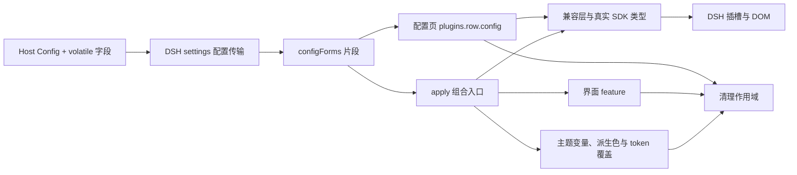

# 项目架构

更新日期：2026-10-02。本文件描述当前架构；各模块现状见 [实施状态](docs/IMPLEMENTATION.md)，验证状态见 [验证记录](docs/VERIFICATION.md)。

插件消费 DSH 的配置、服务与界面插槽，输出可撤销的样式与展示组件。Workspace、Session、消息、输入编辑器与执行状态由 DSH 持有；本项目只拥有启用状态、设计变量、样式表、展示组件及其资源。模型与 effort 的展示控件共享官方 ModelDirectory，不拥有独立选择状态；顶栏尾侧新增的两个入口只转发官方右侧栏的页签动作，不持有面板布局。四个界面 feature（shell、sidebar、new-session、conversation）已是 `implemented`；tool-calls 保留原生交互，statistics 因缺少真实全局用量接口保持关闭。

## 代码地图与边界

| 目录 | 职责 | 允许的依赖 |
| --- | --- | --- |
| `src/shared` | 插件身份、配置解析与 feature 标识 | 自身；不依赖宿主或 DOM |
| `src/host` | Host 插件入口、Schemastery Config（`volatile` 字段进入设置表单） | shared、Host 运行依赖 |
| `src/client/contracts` | FeatureEnvironment、FeatureDefinition、服务与 DOM 端口、配置表单端口 | shared、SDK 类型；CleanupScope 仅类型引用 |
| `src/client/core` | 通用清理和 feature 装配流程 | contracts、shared、core |
| `src/client/compat` | 固定版本的服务接入、DOM 端口、宿主类名、动态几何与展示适配 | contracts、shared、compat |
| `src/client/theme` | 设计变量、语义 token 覆盖、两个 feature 共用的 Composer 几何 | contracts、shared、core、theme |
| `src/client/features/*` | shell、sidebar、new-session、conversation、tool-calls、statistics | 本模块、公共契约／核心／兼容／主题；不能导入兄弟模块；model-controls 为新建／聊天页共用的模型插槽展示，conversation/header-actions 为顶栏尾侧的两个右侧栏入口，settings 为插件自己的配置页（不是 FeatureDefinition，随插件存活而非随启用状态） |
| `src/client/apply.ts` | 唯一的多模块运行组合点 | 上述客户端模块 |
| `scripts` | 构建、架构检查、安装包检查与本地验证工具；`scripts/lib/` 是共享源码 | 开发依赖、Node IO |
| `tests` | 资源恢复与失败隔离的行为验证 | 内部模块，不扩大公共导出 |

**API 边界：** `HostServices` 使用 SDK 原始类型／派生类型；`DomPort` 是本项目管理样式与启用标记的端口；`ConfigFormsPort` 在 contracts 中结构化声明设置传输（提供方 `@deepseek-ai/dsh-client-ui-settings` 不在本项目的类型基线内，见兼容说明）。DSH 插槽组件 props 仍由 SDK 推导。Context 只进入 apply／兼容与注册世界，组件通过派生 props、注入数据和回调访问能力。

## 启用、更新与释放

1. Host `Config` 声明的字段标记 `.volatile()`：DSH 设置层只把 volatile 路径投影成配置表单，浏览器半通过 `ctx.configForms.get(entryId)` 读取同一份数据。
2. 客户端加载器创建的条目不带配置，因此 `apply(ctx)` 不再接受第二个配置参数；它订阅 `ui-skin-ccd-style` 片段，配置变化时先释放旧作用域再按新配置挂载。相同配置的重复发布会被签名比较跳过。
3. `enabled` 默认为 false。启用时先挂载主题层（根属性、设计变量、共用 Composer 几何、语义 token 覆盖），再按 feature 顺序挂载各自的样式与观察器。
4. `mountFeatures()` 只执行已实现且配置启用的模块，为每个模块创建独立 CleanupScope。`planned` 只在 debug 下记录状态。
5. 单个模块挂载失败时回滚已取得的资源，记录错误并继续其他模块；总启用失败时释放全部资源。
6. 停用／配置变化／Cordis effect 释放后，以逆序释放资源，每个 disposer 只执行一次。共享启用标记按同一模块实例内的租约计数管理。
7. **配置页挂在常驻作用域，不属于启用状态。** 它注册进侧栏「插件」页的行配置插槽（`plugins.row.config`，键 `<包名>#<行 id>`），用同一份 `configForms` 片段读写自己的配置；关掉界面后它仍然存在，否则用户无法在应用内把界面开回来。它在 `ctx.inject(['slots','locale'])` 的子作用域里注册自己的 zh／en 字典与页面，随外层 effect 一起释放。
8. **颜色与字体只在主题层算一次。** `theme/palette.ts` 从配置色推导悬停／选中／分隔线等派生色，`theme/tokens.ts` 把宿主语义 token（`--dsw-alias-bg-base`、`--dsw-specific-sidebar-fill`、`--dsw-alias-border-l3`）与插件 token（`--ccd-*`）以及字体栈合成一个覆盖层，交给 `ctx.theme.overrideTokens`。未配置的部分不下发，内置调色板仍由 `theme/tokens.css` 唯一持有；字体栈的默认尾巴是那里的 `--ccd-font-fallback`／`--ccd-code-fallback`，TS 里不复制字体清单。

**架构约束：颜色字面量只允许出现在 `theme/tokens.css`。** 派生色是算术结果（`theme/palette.ts` 的纯函数），token 组合是纯函数（`theme/tokens.ts`），两者都可单测；其余样式表与组件只消费变量。

**架构约束：业务状态只有一个来源——DSH。** 插件不写 Session 日志，不扫描整段流式事件，也不建立第二套项目／会话状态。React 读取可变数据应使用 SDK 注入的标准 hooks；组件不能手工订阅或镜像宿主数据。

**架构约束：资源必须可逆。** 注册返回值、监听器、样式、观察器、异步取消都通过 `scope.add()` 管理。改变原有内联样式或属性时必须记录并恢复：目前只有根属性 `data-dsh-ccd-style`、打开中的菜单上的 `data-ccd-account-menu` 标记与 `--ccd-account-name`（两者都只在菜单打开期间存在，关闭或释放时移除）、被翻转到锚点上方的菜单的 `data-ccd-menu-flipped` 标记与同一模块为它写入的内联 `max-height`（关闭或释放时恢复菜单自己的值），Composer 上的 `--ccd-trailing-width`／`--ccd-model-max-width`、统计按钮上的 `--ccd-stat-value`，打开方式控件上的 `data-ccd-open-mode` 与热区 `title`／`aria-label`、被覆盖主键的 `aria-hidden`／`tabindex`（释放时逐条按原值恢复），新会话默认提示语的现有 Text 节点与对应输入区 aria-label（仅在仍等于本插件写入的值时恢复），视图切换器轨道上的 `--ccd-view-x`／`--ccd-view-w`／`--ccd-view-duration`，以及正文滚动视口上的 `data-ccd-fade-top`／`data-ccd-fade-bottom` 与页面主体上的 `--ccd-fade-bottom-inset`。DOM 不存在时保留原生 UI（样式表本身是惰性的，可以先行挂载）。

**架构约束：不夺取宿主的所有权。** `sidebar`、`main.conversation` 等位置由官方组件独占并声明其子插槽；替换它们会让官方子位置一并消失。因此当前实现不替换 Composer、侧栏或会话壳，也不改写框架列宽。只在无子插槽的 `conversation.input.model` 位置以 priority -10 注册模型／effort 展示组件，在 `conversation.session.header.utilities` 里追加两个右侧栏入口（原生"打开方式""更多"与日程条目保持原位），并在 `compat/open-target.ts` 里只改宿主"打开方式"控件的热区与标注、不替换它渲染的菜单；原生条目始终留在注册表，释放注册后自动恢复。

## 模型与 effort 的共用展示

`features/model-controls/mount.ts` 经 apply 在新建页／聊天页任一 feature 开启时挂载，通过 Cordis 子注入等待 `modelDirectories`、`sessions`、`slots`、`remote` 和 `remote.session`。模型目录服务调用链访问远程命名空间，因此后两项也必须声明。注册层由 SDK 的 session scope 推导 id，读取官方 `directoryFor()`，注入标准 `useSyncExternalStore` hook 与官方 load/select 回调；TSX 不接收 Context、不手工订阅或镜像业务数据。

模型目录、durable selection、pending 与错误均由 DSH 持有；切换模型使用新模型的 defaultEffort，选当前模型保留设置。effort 只列实际支持的档位，无默认 effort 时保留 provider-default；过期拖动与不支持的 effort 在提交边界丢弃。组件内只持有弹层、搜索与连续拖动预览，吸附完成才调用官方 select。Host 确认或失败后回到目录保存的值。

浮层沿窗口固定定位、随面板轨道和窗口尺寸校正。React effect 归属并释放监听器、MutationObserver、ResizeObserver、文字切换计时器、弹簧与像素动画；Cordis 注入 Fiber 与插槽 disposer 归属激活作用域。参考 `zanwei/claude-model-selector` 的 MIT 样式／磁性弹簧／像素算法已注明 LICENSE，全部颜色由主题变量提供；未全局注册 Web Component。

## 版本相关的宿主适配

DSH 用 CSS Modules，类名带构建哈希。所有宿主类名集中在 `src/client/compat/host-dom.ts`，并注明来自哪个包的哪个模块；其他文件不得硬编码宿主类名。稳定锚点用 `data-*` 属性（`data-slot`、`data-conversation-content`、`data-composer-seat` 等）。

框架的三列宽度由 `ui-layout` 在 JavaScript 中求解并写成内联 `grid-template-columns`，样式表无法单独改写侧栏轨道。插件因此**不写任何轨道值**：侧栏宽度始终是 DSH 自己的偏好，分隔线画在侧栏自己的右边缘，拖动时线与指针同步移动（见 [DSH 兼容说明](docs/DSH_COMPATIBILITY.md)）。

Composer 底部的两个位置需要读宿主动态结构：账号菜单的标记与名称镜像（`compat/account-menu.ts`），以及贴着窗口底边的菜单翻转（`compat/composer-menus.ts`；新建页芯片行的工作区选择器与 Agent 预设菜单同样从这个底边位置弹出，卡片高于锚点上方空间时才连同高度上限一起改，卡片离开固定的菜单表面时撤掉）。顶栏尾侧的「打开方式」还需要读第三个量：宿主那个分体按钮里是否渲染了应用菜单的入口（`compat/open-target.ts`）——渲染器只在存在可选应用时才生成 chevron，插件用这个事实决定显示通用打开字形还是整块隐藏，并把被覆盖半边的标注改成与点击行为一致。会话顶栏的视图切换器需要读第三个量：选中段相对轨道的偏移与宽度（`compat/view-switch.ts`），因为滑块要落在宿主自己的按钮上；框架 style 变化即时校正布局，选择变化才执行滑动动画。正文的上下边缘渐隐需要读第四个量：滚动视口两侧是否还有内容，以及常驻 Composer 盖住了视口底部多少（`compat/conversation-fade.ts`）——同一份观察把两个事实发布成属性与 `--ccd-fade-bottom-inset`，渐变层本身仍是样式表的伪元素。**这里不能用 `mask`**：Composer 是滚动视口的子元素（吸附在其中的座位），给视口加遮罩会把输入卡一起擦掉。统计簇偏移还读取原生 Composer trailing 组的实际宽度（`compat/stats-values.ts`），观察框架轨道 style 与模型收缩属性变化，确保拖动右栏时同步，并按控制行剩余空间发布模型按钮宽度上限以保留推理等级；速率与缓存命中的简短读数从宿主标签镜像（没有可算的计费用量时回退到用量总量），宽列显示、窄列省略，原生文本和详情按钮仍由宿主持有。新会话默认提示语通过 `compat/composer-placeholder.ts` 对固定版本已知 hero 文案做小范围展示适配，改现有 Text 节点及对应 aria-label，不替换编辑器、不改草稿；宿主工作区／阻断提示优先，释放时条件恢复。这些适配都只用 MutationObserver 观察（菜单翻转另加 `resize`；`ResizeObserver` 的投递同样依赖渲染步骤，被遮挡时不来，所以不用它做失效信号），仅在清理作用域内持有当前量测／修改节点，释放时清除引用并恢复全部标记、属性及仍属于本插件的文案。

## 构建与分发

Host 构建为 ESM，运行依赖保持外置。Client 用 esbuild 打成单个 CommonJS factory，再包装为 `window.__ModuleLoader__.load({ id, factory(require) })`；React、Cordis 和 DSH 静态共享库从宿主模块表取得，不能打入私有副本。动态功能插件只能类型导入。

CSS 按文本打进所属客户端模块，只有激活时挂载。声明文件由 TypeScript 生成；开发 watch 更新 JS/CSS，正式 build 更新声明。安装包仅包含根目录 `lib/`、`cordis.patch.yml`、README、LICENSE 和 package.json。MIT 许可证及采用的 DSH 图标／文案归属已在 LICENSE 中声明；`private: true` 仍阻止 npm 公开发布。

`npm run check` 覆盖类型、模块边界、颜色归属、现有 Markdown 的本地链接、行为测试、构建和包内容。文档检查从根目录与 `docs/` 自动发现 Markdown，不依赖已删除的计划文件。运行工具与证据的边界见 [验证记录](docs/VERIFICATION.md)；清理本地文件时，profile 或备份引用的 tarball 必须保留。

## 如何继续实现

把模块入口的 `PlannedFeature` 改为 `ImplementedFeature`，实现同步 `mount(environment, scope)`。在这个入口完成插槽注册，组件放该 feature 下的 `.tsx`，所有注册返回的 disposer 放入 scope。需要异步工作时立即注册取消资源，避免挂载函数返回未受管理的 Promise。

新增共享接口放 contracts；新增宿主差异放 compat；多模块关联放 apply。修改后执行 `npm run check`，再完成该模块实际 DSH 验证，并更新 docs/VERIFICATION.md。
