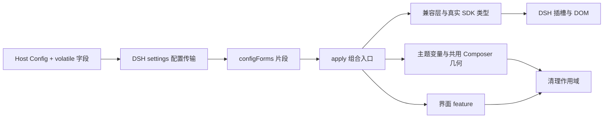

# 项目架构

更新日期：2026-10-01。本文件描述当前骨架事实；产品目标见 PLAN，验证状态见 [验证记录](docs/VERIFICATION.md)。

插件消费 DSH 的配置、服务与界面插槽，输出可撤销的样式与展示组件。Workspace、Session、消息、输入编辑器与执行状态由 DSH 持有；本项目只拥有启用状态、设计变量、样式表、展示组件及其资源。四个界面 feature（shell、sidebar、new-session、conversation）已是 `implemented`；tool-calls 保留原生交互，statistics 因缺少真实全局用量接口保持关闭。

## 代码地图与边界

| 目录 | 职责 | 允许的依赖 |
| --- | --- | --- |
| `src/shared` | 插件身份、配置解析与 feature 标识 | 自身；不依赖宿主或 DOM |
| `src/host` | Host 插件入口、Schemastery Config（`volatile` 字段进入设置表单） | shared、Host 运行依赖 |
| `src/client/contracts` | FeatureEnvironment、FeatureDefinition、服务与 DOM 端口、配置表单端口 | shared、SDK 类型；CleanupScope 仅类型引用 |
| `src/client/core` | 通用清理和 feature 装配流程 | contracts、shared、core |
| `src/client/compat` | 固定版本的服务接入、DOM 端口、宿主类名与列宽补偿、插槽名称 | contracts、shared、compat |
| `src/client/theme` | 设计变量、语义 token 覆盖、两个 feature 共用的 Composer 几何 | contracts、shared、core、theme |
| `src/client/features/*` | shell、sidebar、new-session、conversation、tool-calls、statistics | 本模块、公共契约／核心／兼容／主题；不能导入兄弟模块 |
| `src/client/apply.ts` | 唯一的多模块运行组合点 | 上述客户端模块 |
| `scripts` | 构建、架构检查、安装包检查与本地验证工具 | 开发依赖、Node IO |
| `tests` | 资源恢复与失败隔离的行为验证 | 内部模块，不扩大公共导出 |

**API 边界：** `HostServices` 使用 SDK 原始类型／派生类型；`DomPort` 是本项目管理样式与启用标记的端口；`ConfigFormsPort` 在 contracts 中结构化声明设置传输（提供方 `@deepseek-ai/dsh-client-ui-settings` 不在本项目的类型基线内，见兼容说明）。DSH 插槽组件 props 仍由 SDK 推导。Context 只进入 apply／兼容与注册世界，组件通过派生 props、注入数据和回调访问能力。

## 启用、更新与释放

1. Host `Config` 声明的字段标记 `.volatile()`：DSH 设置层只把 volatile 路径投影成配置表单，浏览器半通过 `ctx.configForms.get(entryId)` 读取同一份数据。
2. 客户端加载器创建的条目不带配置，因此 `apply(ctx)` 不再接受第二个配置参数；它订阅 `ui-skin-ccd-style` 片段，配置变化时先释放旧作用域再按新配置挂载。相同配置的重复发布会被签名比较跳过。
3. `enabled` 默认为 false。启用时先挂载主题层（根属性、设计变量、共用 Composer 几何、语义 token 覆盖），再按 feature 顺序挂载各自的样式与观察器。
4. `mountFeatures()` 只执行已实现且配置启用的模块，为每个模块创建独立 CleanupScope。`planned` 只在 debug 下记录状态。
5. 单个模块挂载失败时回滚已取得的资源，记录错误并继续其他模块；总启用失败时释放全部资源。
6. 停用／配置变化／Cordis effect 释放后，以逆序释放资源，每个 disposer 只执行一次。共享启用标记按同一模块实例内的租约计数管理。

**架构约束：业务状态只有一个来源——DSH。** 插件不写 Session 日志，不扫描整段流式事件，也不建立第二套项目／会话状态。React 读取可变数据应使用 SDK 注入的标准 hooks；组件不能手工订阅或镜像宿主数据。

**架构约束：资源必须可逆。** 注册返回值、监听器、样式、观察器、异步取消都通过 `scope.add()` 管理。改变原有内联样式或属性时必须记录并恢复：目前只有根属性 `data-dsh-ccd-style`、打开中的菜单上的 `data-ccd-account-menu` 标记与 `--ccd-account-name`（两者都只在菜单打开期间存在，关闭或释放时移除）、被翻转到锚点上方的菜单的 `data-ccd-menu-flipped` 标记，以及视图切换器轨道上的 `--ccd-view-x`／`--ccd-view-w`。DOM 不存在时保留原生 UI（样式表本身是惰性的，可以先行挂载）。

**架构约束：不夺取宿主的所有权。** `sidebar`、`main.conversation` 等位置由官方组件独占并声明其子插槽；替换它们会让官方子位置一并消失。因此本项目只做加性注册与插件作用域样式，不复制官方 Composer、侧栏或会话壳。唯一需要读取宿主动态几何的地方是框架列宽（见下）。

## 版本相关的宿主适配

DSH 用 CSS Modules，类名带构建哈希。所有宿主类名集中在 `src/client/compat/host-dom.ts`，并注明来自哪个包的哪个模块；其他文件不得硬编码宿主类名。稳定锚点用 `data-*` 属性（`data-slot`、`data-conversation-content`、`data-composer-seat` 等）。

框架的三列宽度由 `ui-layout` 在 JavaScript 中求解并写成内联 `grid-template-columns`，样式表无法单独改写侧栏轨道。插件因此**不写任何轨道值**：侧栏宽度始终是 DSH 自己的偏好，分隔线画在侧栏自己的右边缘，拖动时线与指针同步移动（见 [DSH 兼容说明](docs/DSH_COMPATIBILITY.md)）。

Composer 底部的两个位置需要读宿主动态结构：账号菜单的标记与名称镜像（`compat/account-menu.ts`），以及贴着窗口底边的菜单翻转（`compat/composer-menus.ts`）。会话顶栏的视图切换器需要读第三个量：选中段相对轨道的偏移与宽度（`compat/view-switch.ts`），因为滑块要落在宿主自己的按钮上。三者都只用 MutationObserver 观察，不持有宿主节点，释放时清除全部标记与属性。

## 构建与分发

Host 构建为 ESM，运行依赖保持外置。Client 用 esbuild 打成单个 CommonJS factory，再包装为 `window.__ModuleLoader__.load({ id, factory(require) })`；React、Cordis 和 DSH 静态共享库从宿主模块表取得，不能打入私有副本。动态功能插件只能类型导入。

CSS 按文本打进所属客户端模块，只有激活时挂载。声明文件由 TypeScript 生成；开发 watch 更新 JS/CSS，正式 build 更新声明。安装包仅包含 lib、patch、README 和 package.json。项目保持 private，公开发布前需补许可证。

## 如何继续实现

把模块入口的 `PlannedFeature` 改为 `ImplementedFeature`，实现同步 `mount(environment, scope)`。在这个入口完成插槽注册，组件放该 feature 下的 `.tsx`，所有注册返回的 disposer 放入 scope。需要异步工作时立即注册取消资源，避免挂载函数返回未受管理的 Promise。

新增共享接口放 contracts；新增宿主差异放 compat；多模块关联放 apply。修改后执行 `npm run check`，再完成该模块实际 DSH 验证，并更新 docs/VERIFICATION.md。
