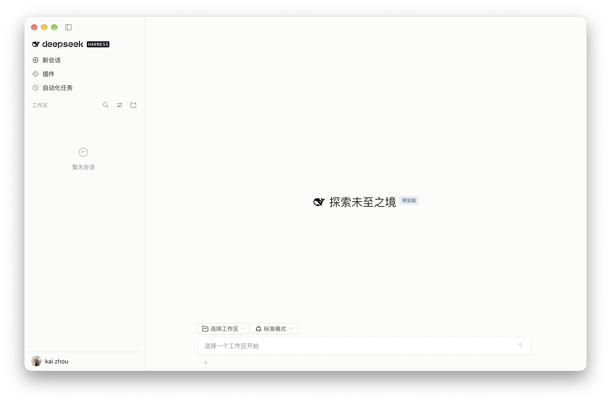
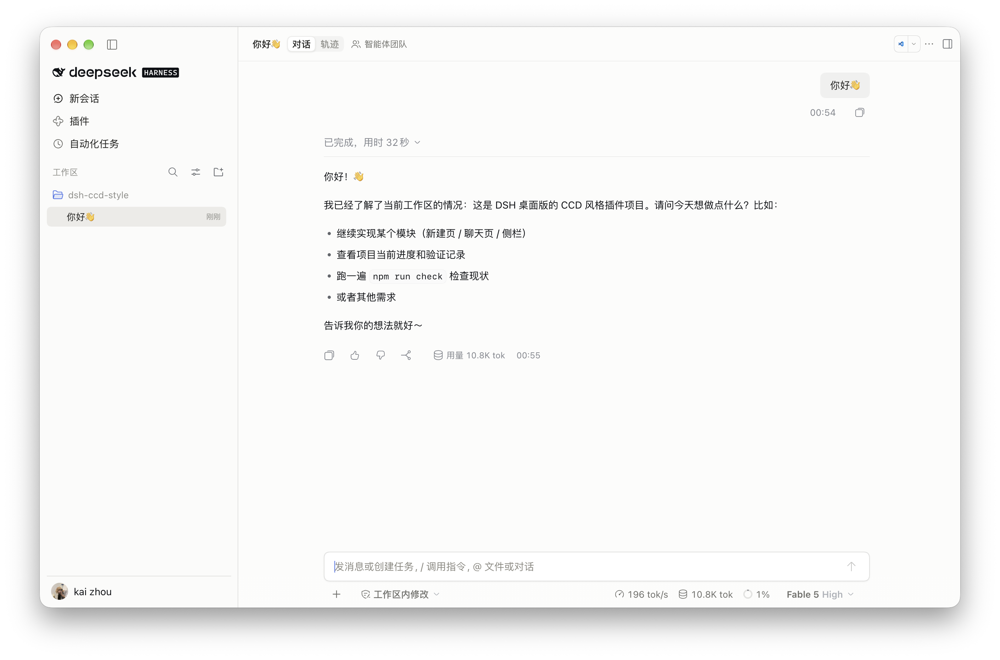

<div align="center">

# DSH Claude Code Desktop Style

Claude Code Desktop 风格布局，DSH 原生能力。<br>
CCD-inspired presentation, powered by native DSH.

[Agent 安装指南](install.md)

</div>

---

面向 **DeepSeek Harness Desktop** 的界面插件，调整侧栏、新建会话页、聊天页与输入区的布局和观感。保留 DSH 品牌、真实工作区与会话数据，以及官方 Composer、模型、权限和工具交互；关闭开关即可恢复原生界面。

## 🎬 截图

**新建会话页 · New session**



**聊天页 · Conversation**



## 📥 安装指南

当前支持 **macOS、浅色模式、DSH `0.2.0-rc.2`**。深色模式、Windows／Linux 和其他 DSH 版本尚未适配。当前通过源码构建安装，npm 公开发布尚未开启。

### 交给 Agent 安装

复制下面的指令，让 Agent 按 [安装指南](install.md) 完成环境检查、配置备份、构建、安装、启用和验证：

```text
请读取 https://github.com/zkforge/dsh-ccd-style/blob/main/install.md，
在本机安装并启用 DSH Claude Code Desktop Style，保留已有 profile 和其他插件配置。
完成验证后报告安装包路径、配置备份位置与实际启用状态；未验证的步骤请明确说明。
```

### 手动从源码安装

需要 Git、Node.js `>=22.18.0`、npm，以及已启动过至少一次的 DSH Desktop `0.2.0-rc.2`。默认应用位置为 `/Applications/DeepSeek Harness.app`；使用其他路径或自定义 `DSH_HOME` 时，按 [完整安装指南](install.md) 调整。

在新的工作目录执行：

```sh
(
set -eu
git clone https://github.com/zkforge/dsh-ccd-style.git
cd dsh-ccd-style
npm ci --cache .cache/npm

mkdir -p artifacts
ccd_install_dir="$(mktemp -d "$PWD/artifacts/install.XXXXXX")"
npm pack --cache .cache/npm --pack-destination "$ccd_install_dir"
ccd_version="$(node -p 'require("./package.json").version')"

"/Applications/DeepSeek Harness.app/Contents/Resources/runtime/cli/bin/dsh" \
  plugin --profile desktop add "$ccd_install_dir/dsh-ccd-style-$ccd_version.tgz"
)
```

打包前会自动执行类型、架构、行为测试、构建与安装包检查，检查失败时停止。每次使用唯一的安装包路径，避免重装时复用旧缓存。**保留生成的 `artifacts/install.*/` 目录**，profile 的依赖仍会引用其中的包。已有配置的备份与升级流程见安装指南。

### 启用与恢复

安装后在 DSH 中按 **⌘R** 重新加载，进入侧栏「插件」→ `dsh-ccd-style` → 点开组件行 `ui-skin-ccd-style`，在配置页打开 **「启用 CCD 风格界面」**，并使用浅色主题。若新安装的包未被加载，保存当前工作后正常重启 DSH。

插件默认关闭；安装成功后没有视觉变化时，先检查启用开关。

配置页上能改的（**即时生效，没有保存按钮**）：

| 配置 | 默认值 | 作用 |
| --- | --- | --- |
| `enabled` | `false` | 总开关；关闭后配置页仍可打开，可随时开回来 |
| `features.shell` / `sidebar` / `new-session` / `conversation` | `true` | 四个已实现模块的独立开关 |
| `appearance.canvas` | 空 | 会话与画布背景色（`#rrggbb`）；留空用内置值 |
| `appearance.sidebar` | 空 | 侧栏背景色（`#rrggbb`）；留空用内置值 |
| `fonts.uiLatin` | 空 | 界面字体族名；留空用系统字体栈 |
| `fonts.code` | 空 | 代码与等宽字体族名；留空用系统栈 |

只留在 `cordis.patch.yml` 里、不在界面上的进阶字段：

| 配置 | 默认值 | 作用 |
| --- | --- | --- |
| `debug` | `false` | 往浏览器控制台输出 `[dsh-ccd-style]` 排障日志（停用提示、宿主锚点缺失、右侧栏服务不可用） |
| `fonts.uiCjk` | 空 | 中文字体族名，排在界面字体之后；想「西文一个字体 + 中文另一个字体」时才需要 |
| `features.tool-calls` / `statistics` | `false` | 尚未实现的模块，开启只写一条调试日志 |

配置页**即时生效、没有保存按钮**：开关／颜色／字体一改就写入当前 profile 的 `cordis.patch.yml`，文本字段在失焦或回车时写入；页脚一行状态显示「写入中／已保存／被拒绝」。背景色会带动悬停、选中、分隔线等派生色一起重算；字体只影响界面与代码，右侧栏终端、文档预览和数学公式保留各自内置字体。深色模式尚未适配，请使用浅色主题。

关闭总开关即可恢复原生界面，再次开启即可恢复风格。当前会话的原生用量读数保留；独立的跨会话统计面板尚未实现。

卸载时使用与安装相同的应用路径、数据目录和 profile：

```sh
"/Applications/DeepSeek Harness.app/Contents/Resources/runtime/cli/bin/dsh" \
  plugin --profile desktop remove dsh-ccd-style
```

如果曾手动添加用户层配置覆盖，只移除 `id: ui-skin-ccd-style` 对应条目，保留其他配置，随后重载。更新与回退的详细步骤见 [安装指南](install.md)。

## 🤝 参与贡献

欢迎提交 [Issue](https://github.com/zkforge/dsh-ccd-style/issues) 或 Pull Request。报告界面问题时，请提供 DSH 版本、系统、主题、窗口尺寸、复现步骤，以及隐藏敏感信息后的截图。

开发环境使用 Node.js `>=22.18.0` 和 npm。在仓库根目录执行：

```sh
npm ci --cache .cache/npm
npm run check
npm run dev
```

`check` 执行类型、架构、行为测试、构建和安装包检查。`dev` 监听并重建 JS/CSS，不自动安装插件或重载 DSH；正式打包前使用完整构建更新声明文件。根目录 `lib/` 是生成目录，`scripts/lib/` 是构建源码。

提交前运行 `npm run check`。视觉修改按同尺寸截图验收；生命周期或业务入口变化验证对应行为，并更新验证记录，区分本地检查和真实 DSH 运行结果。

- [代理约束](AGENTS.md)：开发规则与检查命令。
- [架构](ARCHITECTURE.md)：模块边界、状态归属与资源清理。
- [当前实现](docs/IMPLEMENTATION.md)：各模块的行为与开发入口。
- [兼容说明](docs/DSH_COMPATIBILITY.md)：SDK、加载协议与宿主适配。
- [验证记录](docs/VERIFICATION.md) · [待办](docs/TECH_DEBT.md)：已确认结果、限制与后续工作。

## 📄 开源许可证

[MIT](./LICENSE) © 2026 zkforge。

采用的 DSH 图标与提示文案归属已在 LICENSE 中声明。插件使用系统字体，不包含 Anthropic Sans／Serif 字体文件。
