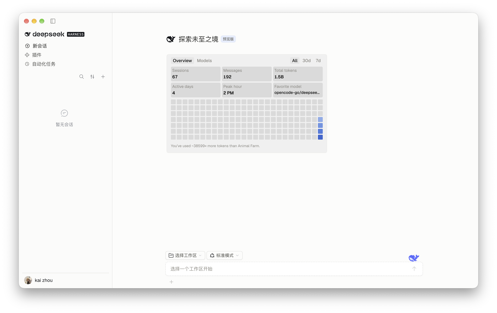
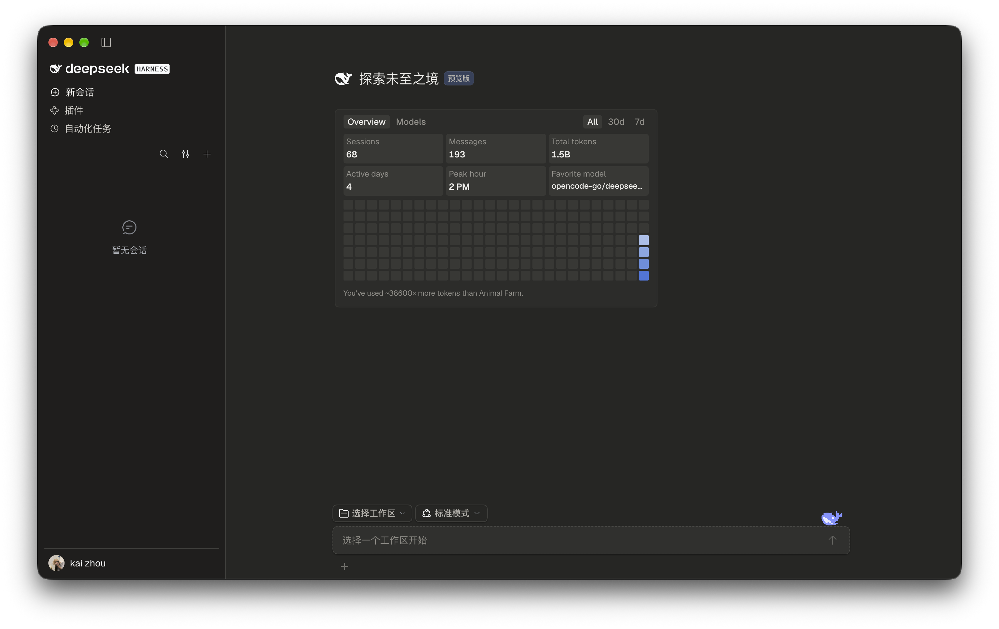
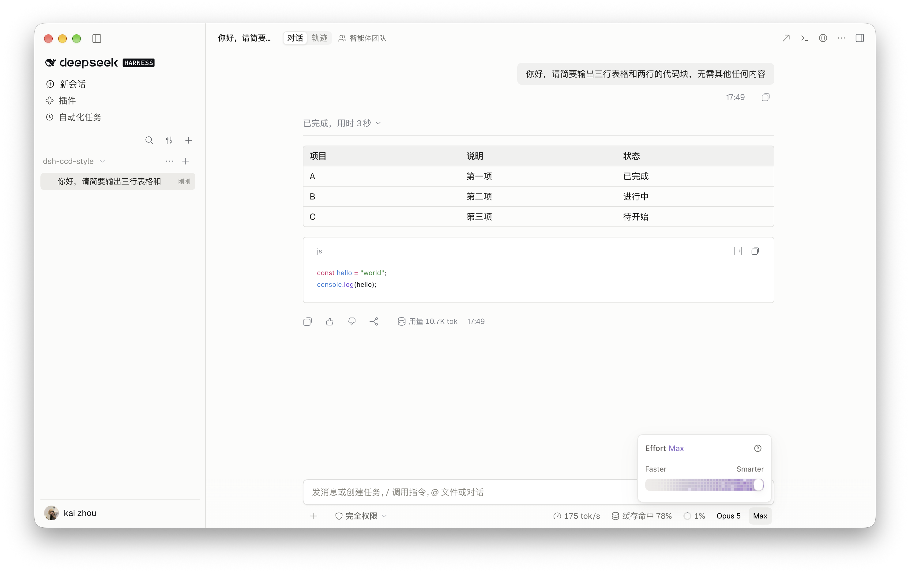
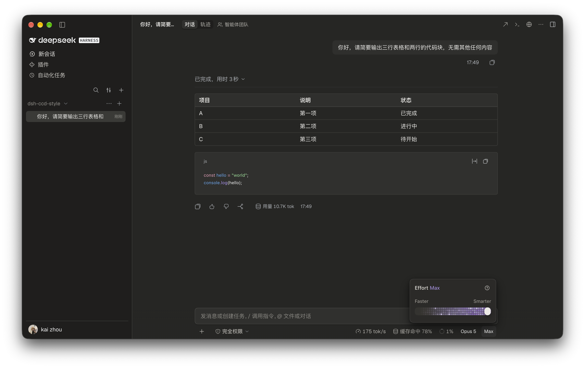
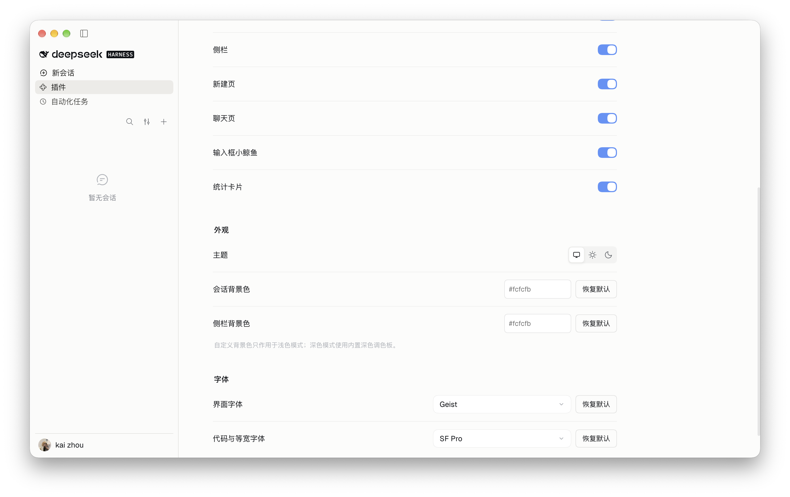
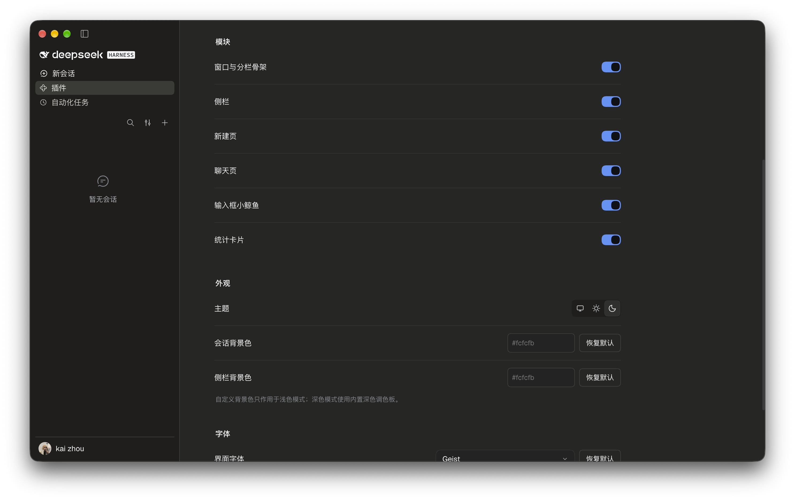

<div align="center">

# 🐳 DSH Claude Code Desktop Style

### 为 DeepSeek Harness Desktop 换上 Claude Code Desktop 外观

<p align="center">
  
  
  
  
  
  
</p>

---

紧凑侧栏、统一的新会话页与聊天页、独立的模型与 effort 选择器，跟随宿主的浅色 / 深色主题，首次安装后自动开启。

[安装指南](https://github.com/zkforge/dsh-ccd-style/blob/main/install.md) · [架构说明](https://github.com/zkforge/dsh-ccd-style/blob/main/ARCHITECTURE.md) · [问题反馈](https://github.com/zkforge/dsh-ccd-style/issues)

</div>

## 🌟 核心特性

<div align="center">

<table>
<tr>
<td width="25%" align="center">
<b>🧩 紧凑侧栏</b><br/>
导航、工作区与会话列表
</td>
<td width="25%" align="center">
<b>💬 统一会话页</b><br/>
新会话页与聊天页同一套布局
</td>
<td width="25%" align="center">
<b>🎛️ 模型与 effort</b><br/>
独立选择器，支持搜索与滑块
</td>
<td width="25%" align="center">
<b>🐳 像素小鲸鱼</b><br/>
待机眨眼与摆尾
</td>
</tr>
</table>

</div>

- **紧凑侧栏**：工作区导航与会话列表，新会话条目在第一次发送后出现。
- **统一会话页**：新会话页、输入卡片与聊天布局共用一套样式，正文边缘随滚动渐隐。
- **模型与 effort**：两个独立选择器，支持搜索、滑块和键盘操作。
- **会话顶栏**：提供终端、浏览器和应用打开入口。
- **Markdown 排版**：链接、行内代码、表格与代码块按 CCD 风格重绘。
- **像素小鲸鱼**：停在新会话页的输入卡旁，待机时眨眼与摆尾。
- **主题跟随**：跟随 DSH 的浅色、深色和系统主题，支持自定义背景色与字体。
- **用量统计卡片**：Overview／Models 视图、时间范围、贡献热力图与模型图表，默认关闭。

## 🖼️ 界面预览

截图为 macOS 版本，使用默认配色与 Geist 字体，统计卡片已开启。

<div align="center">

|  | 浅色 | 深色 |
| --- | --- | --- |
| 新会话页 |  |  |
| 聊天页 |  |  |
| 插件设置 |  |  |

</div>

## 🚀 安装

当前使用**源码安装**，复制以下指令交给 Agent：

```text
请按 https://github.com/zkforge/dsh-ccd-style/blob/main/install.md 安装 DSH Claude Code Desktop Style。
```

> [!IMPORTANT]
> npm 发布及市场收录完成后，下表的三个入口才可用；在此之前请按上面的源码安装流程操作。

<div align="center">

| 入口 | 安装方式 |
| --- | --- |
| 官方插件页 | 「插件 → 添加插件」输入 `dsh-ccd-style` |
| 终端 | `dsh plugin --profile desktop add dsh-ccd-style` |
| 插件市场 | 搜索 `dsh-ccd-style` 并安装 |

</div>

首次安装后插件自动开启，升级沿用已保存的配置。

## ⚙️ 配置

打开「插件 → dsh-ccd-style → ui-skin-ccd-style」，调整总开关、模块、主题、颜色和字体。改动即时生效。

<div align="center">

| 分组 | 可调项 |
| --- | --- |
| 模块 | 窗口与分栏骨架、侧栏、新建页、聊天页、输入框小鲸鱼、统计卡片 |
| 外观 | 主题（浅色 / 深色 / 跟随系统）、会话背景色、侧栏背景色 |
| 字体 | 界面字体、代码与等宽字体 |

</div>

> [!NOTE]
> 自定义背景色只作用于浅色模式，深色模式使用内置深色调色板。界面默认使用 Geist，未安装时回退系统字体；仓库的 `assets/fonts/` 提供本机安装用字体与 OFL 许可，字体不包含在 npm 包中。

## 🛠️ 环境要求

<div align="center">

| 项目 | 要求 |
| --- | --- |
| 宿主 | DSH `0.2.0-rc.2` |
| 平台 | macOS（Apple 芯片）、Windows 10 及以上（64 位） |
| 主题 | 浅色、深色与跟随系统 |
| 开发环境 | Node.js ≥ 22.18.0 |

</div>

## 🧑‍💻 开发

```sh
npm ci --cache .cache/npm
npm run check
npm run pack:local --cache .cache/npm
```

`npm run check` 依次执行类型检查、模块边界与文档链接检查、测试、构建和包内容校验。

<details>
<summary><b>全部脚本</b></summary>

| 脚本 | 作用 |
| --- | --- |
| `npm run typecheck` | TypeScript 类型检查 |
| `npm run check:architecture` | 模块边界、颜色归属与本地文档链接 |
| `npm test` | 配置、生命周期、布局适配与统计行为测试 |
| `npm run build` | 构建 Host 与 Client 产物 |
| `npm run check:package` | 校验 npm 安装包内容 |
| `npm run check` | 依次执行以上全部 |
| `npm run dev` | 客户端增量构建 |
| `npm run pack:local` | 生成用于本地安装的 tarball |

</details>

代码结构见 [ARCHITECTURE.md](https://github.com/zkforge/dsh-ccd-style/blob/main/ARCHITECTURE.md)。

## 📮 反馈与许可

通过 [Issue](https://github.com/zkforge/dsh-ccd-style/issues) 反馈问题，附上 DSH 版本、窗口尺寸和复现步骤。

[MIT](./LICENSE) © 2026 zkforge。
